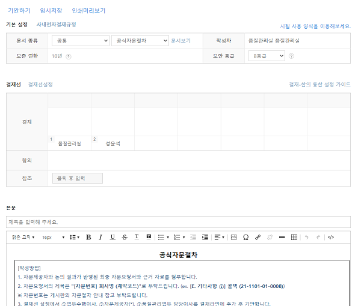
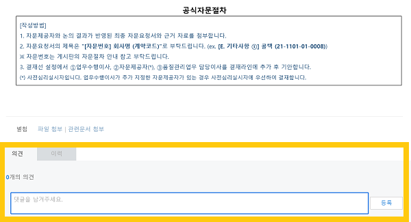

## 개요

본 항목은 감사업무 자문절차에 대하여 안내합니다. 해당 절차는 감사업무의 수행 시 회계/회계감사에 관한 필수 자문대상의 공식적 자문절차에 적용합니다.

## 관련 규정

법인의 자문절차는 [품질관리규정 제31조-제34조](/policy/internalPolicy/90-품질관리규정/#31)에서 정한 바에 따릅니다.

## 자문 절차

### 자문 절차의 성격

[품질관리기준서](https://www.kicpa.or.kr/portal/default/kicpa/gnb/kr_pc/menu08/menu01/menu02.page)나 [외감규정 별표1 등록요건](https://www.law.go.kr/LSW//flDownload.do?flSeq=127741905&flNm=%5B%EB%B3%84%ED%91%9C+1%5D+%EC%A3%BC%EA%B6%8C%EC%83%81%EC%9E%A5%EB%B2%95%EC%9D%B8+%EA%B0%90%EC%82%AC%EC%9D%B8+%EB%93%B1%EB%A1%9D%EC%9A%94%EA%B1%B4%28%EC%A0%9C8%EC%A1%B0%EC%A0%9C1%ED%95%AD+%EA%B4%80%EB%A0%A8%29)은 자문절차를 설계, 운영할 것을 요구하고 있습니다. 

품질관리기준서는 자문 대상으로 '어렵거나 논쟁의 여지가 있는 사항'이라 정하고 있습니다. 

??? quote "품질관리기준서 문단 34, A36-A40"
    자문
    
    34 회계법인은 다음 사항에 대한 합리적 확신을 제공하도록 설계된 정책과 절차를 수립하여야 한다. <b>(a) 어렵거나 논쟁의 여지가 있는 사항에 대하여 적합한 자문이 이루어짐.</b> (b) 적합한 자문이 이루어질 수 있도록 충분한 자원이 이용 가능함. (c) 이러한 자문의 성격과 범위, 그리고 해당 자문에 따른 결론이 문서화되며, 이에 대하여 자문을 구하는 사람과 자문을 제공한 사람이 모두 동의함. (d) 자문에 따른 결론이 실행됨. (문단 A36-A40 참조)

    자문 (문단 34 참조) 

    A36 자문에는 특별한 전문성을 가진 회계법인 내·외의 개인과의 적절한 전문적 수준의 토의가 포함된다.

    A37 자문에는 회계법인의 집합적인 경험과 기술적 전문성뿐 만 아니라 적합한 연구자원들이 활용된다. 자문은 품질을 높이고 전문가적 판단을 향상시킨다. 회계법인의 정책과 절차에서 자문을 적절하게 인정하는 것은 자문이 강점으로 인정되는 문화를 촉진하며 구성원들이 어렵거나 논란의 여지가있는 사항에 대해 자문을 구하도록 격려한다. 

    A38 유의적인 기술적, 윤리적 및 기타 사항들에 대하여 회계법인 내부(또는 해당되는 경우, 외부)의 효과적인 자문은 다음과 같은 경우에 이루어질 수 있다. • 해당 문제에 정통한 조언을 제공할 수 있도록 자문제공자에게 모든 관련 사실이 제공됨. • 자문제공자가 적절한 지식과 연륜 및 경험을 가지고 있음. 또한 자문의 결론이 적절히 문서화되고 실행되어야 한다.

    A39 어렵거나 논란의 여지가 있는 사항에 대한 다른 전문가들의 자문을 아주 완벽하고 자세하게 문서화하면, 다음 사항을 이해하는 데 도움이 된다. • 자문을 구하였던 이슈 • 자문의 결과 (관련 결정, 그러한 결정의 근거 및 해당 결정의 실행방법 포함) 
    
    소규모 회계법인에 특유한 고려 사항 

    A40 예를 들어 적절한 내부자원이 없는 경우와 같이, 외부에서 자문을 받을 필요가 있는 회계법인은 다음과 같이 자문서비스를 받을 수 있을 것이다. • 다른 회계법인 • 전문직 단체나 규제기관 • 관련 품질관리서비스를 제공하는 상업적 조직 회계법인이 이러한 자문서비스를 계약하기 전에 외부 자문제공자의 적격성과 역량을 검토하면, 외부 자문제공자가 해당 목적에 적격한지 결정하는 데 도움이 된다. 

한편, 등록요건은 품질관리실 전담 업무로 자문을 포함합니다. 외부감사시 준수해야 할 법령, 전문지식 등에 대한 자문입니다. 

??? quote "등록요건 [별표 1] 주권상장법인 감사인 등록요건(제8조제1항 관련) 1. 인력"
    라. 품질관리업무 담당이사와 품질관리업무 담당자는 다음의 업무만을 수행한다. 1) 품질관리 제도의 설계 및 관리 2) 감사보고서 발행 전ㆍ후 심리(감사업무 수행과정에서의 중요한 판단 사항 및 감사보고서 작성 내용을 감사조서, 증빙자료 등에 따라객관적으로 평가하여 감사의견에 흠결이 없도록 하는 품질관리 활동을 말한다) <b>3) 법령등ㆍ회계처리기준ㆍ회계감사기준ㆍ품질관리기준 등 외부감사시 준수해야할 사항에 관한 자문</b> 4) 외부감사 업무 수임 건의 감사위험(감사인이 중요하게 왜곡표시되어 있는 재무제표에 대하여 부적절한 감사의견을 표명할 위험을 말한다. 이하 같다) 유무 확인 등 타당성 검토 5) 품질관리 관련 교육훈련 기획 및 운영 6) 법 제26제1항제3호에 따른 감리 결과에 대한 개선권고사항 이행상태점검 7) 감사조서 관리 8) 그 밖에 주권상장법인 감사인 등록요건 유지 등 품질관리에 관한업무

감사기준서 620 '감사인측 전문가가 수행한 업무의 활용'은 전문가 활용의 맥락에서 자문의 성격을 잘 드러내고 있습니다. 

??? quote "감사기준서 620 문단 1-2"
    
    1 이 감사기준서는 회계나 감사 외의 분야에서 전문성을 지닌 개인이나 조직의 업무가 감사인이 충분하고 적합한 감사증거를 입수하는 데 도움을 주기 위해 활용되는 경우 그러한 업무와 관련된 감사인의 책임을 다룬다.

    2 이 감사기준서는 다음에 대해서는 다루지 아니한다. <b>(a) 업무팀이 회계나 감사의 특정 전문 분야에 전문성을 지니고 있는 팀원을 보유하고 있거나, 그러한 전문성을 지닌 개인이나 조직에게 자문을 구하는 경우. 이는 감사기준서 220에서 다룬다.</b> (b) 회계나 감사 외의 분야에 전문성을 지니고 있는 개인 또는 조직이 수행하는 해당 분야의 업무를 기업이 재무제표 작성을 지원하는 데 이용하고(경영진측 전문가), 감사인이 해당 경영진측 전문가가 수행한 업무를 활용하는 경우. 이는 감사기준서 500에서 다룬다.

감사기준서에 따라 판단하자면, 품질관리기준서의 자문은 감사업무에 회계, 감사 전문가를 활용한 경우를 의미합니다. 회계법인에 소속한 회계, 감사 전문가는 회계, 감사 논제에 대하여 토론하고, 상호 자문하는 문화에 익숙합니다. 중요한 사항에 대해서만 상호 자문이 이루어지는 것은 아닙니다. 또한, 모든 자문 내용이 문서화되는 것도 아닙니다.

우리는 품질관리기준서나 외감규정에서 요구하는 자문을 정식 자문 절차(formal consultation process)라 부르고 관리하겠습니다. 정식 자문 절차는 <b>중요한 회계, 감사 이슈</b>에 대해 업무수행이사가 업무팀원과 <b>심리 실시자를 포함한 내·외부 전문가</b>의 의견을 수렴하여 내린 결론에 대하여, <b>품질관리업무 담당이사가 승인</b>하고, 그 <b>결과를 조서화</b>하는 과정입니다. 

### 자문 대상 - 중요한 회계, 감사 이슈

[내규](/policy/internalPolicy/91-품질관리규정(부록)/#17)에 따른 자문 대상은 다음과 같습니다.

??? note "품질관리규정(부록) 제17조(자문이 필요한 경우)"

    다음 각호와 같은 경우 또는 이에 준하는 경우에는 자문을 받도록 하여야 한다.

    1. 새로 발표된 전문적 기술적인 규정의 적용
    2. 회계, 감사 및 법 규정 상 특수한 내용이 적용되는 업종
    3. 최근에 부각되기 시작하는 서비스에 대한 처리
    4. 법적인 보고의무, 특히 외국정부에 보고하는 경우
    5. 새로 시행되는 대체적 회계기준을 선택하거나 회계기준을 변경하는 경우
    6. 보고서를 재발행하거나, 보고서 발행 이후에 누락된 절차를 수행하거나 또는 보고서 발행일 현재 존재하였던 사실을 나중에 발견한 경우
    7. 현안이 되고 있는 회계 및 감사기준의 적용에 대한 소명을 위하여 규제기관과의 회의에 소환된 경우

위의 자문 항목이 실질적으로 운영될 수 있도록 품질관리업무 담당이사가 정한 공식 자문 대상[^1]은 다음과 같습니다.

[^1]:

    기존에 필수 자문 대상이라 하였으나 용어를 정비하여 공식 자문 대상이라 하겠습니다.

!!! note "선진회계법인 공식 자문 대상"

    A. 회계처리

    1. 한국채택국제회계기준의 요구사항으로부터의 일탈 (K-IFRS 1001.19-24)
    2. 회계정책의 자발적 변경 (K-IFRS 1008.14(2), 일반기업회계기준 5.9(2))
    3. 감사대상회사와 회계처리에 관한 중요한 의견차이가 해소되지 않은 경우
    4. 그룹/부문 감사인과 회계처리에 관한 중요한 의견차이가 해소되지 않은 경우
    5. 규제기관이 관련 회계처리에 관한 정보 또는 설명을 요구하는 경우
    6. 규제기관의 요구에 따라 재무제표를 재작성하거나 회계정책을 변경한 경우

    B. 감사범위의 제한/감사 증거를 충분하게 입수하지 못한 경우
    
    1. 경영자 확인서를 제공받지 못한 경우
    2. 변호사 조회내용이 불분명한 경우
    3. 조회 요청과 관련하여 범위가 제한되었거나, 조회서가 충분히 회수되지 않거나, 대체적 절차로 충분하고 적합한 감사증거를 입수하지 못한 경우
    4. 감사를 수행하였으면 발견가능할 왜곡표시가 중요하고 전반적(pervasive)이라 판단한 경우
    5. 주요 경영진이 감사업무에 제한을 가하는 경우
    6. 부문 감사업무의 수행시 충분한 감사증거를 입수하지 못한 경우
    7. 부문 또는 그룹 경영진과 부문 재무제표에 관한 중요한 이슈사항에 대한 커뮤니케이션이 부족한 경우

    C. 미수정왜곡표시, 부정 의혹과 법규 미준수
    
    1. 통제 환경으로 중요한 왜곡표시의 방지, 적발, 수정되지 못한다고 판단한 경우
    2. 수정 왜곡표시가 개별적 또는 집합적으로 중요하다 판단한 경우 (감사기준서 450)
    3. 외감법 제22조 제1항에 해당하는 이사의 직무수행 관련 부정행위 또는 정관에 위반되는 중대한 사실을 발견한 경우
    4. 외감법 제22조 제2항에 해당하는 회사의 회계처리 등에 관한 회계처리기준 위반 사실을 발견한 경우
    5. 경영진이 의도적으로 통제 예외사항을 발생시켰다 판단한 경우
    6. 지배기구의 신뢰성에 의문이 생긴 경우
    7. 기타 정보와 재무보고 내용에 중요한 불일치사항이 있거나 기타 정보에 중요한 사실의 왜곡이 있는 경우
    8. 문서 조작 등이 발견되어 감사정보의 신뢰성에 의문이 생기는 경우

    D. 계속기업가정과 기타 잠재적 보고서 변형 사유
    
    1. 계속기업가정 관련 감사 증거가 충분하지 못하거나 감사보고서의 변형을 고려한 경우[^2]
    2. 계속기업가정을 적용하지 못하여 청산기준으로 재무제표를 작성한 경우
    3. 감사의견변형[^2]
    4. 당기의 감사와 관련하여 전기재무제표에 대하여 보고할 때 만약 전기재무제표에 대한 감사의견이 해당 감사인이 이전에 표명한 의견과 다른 경우 (감사기준서 710)
    5. 감사보고서일 이후 경영진이 재무제표를 수정한 경우
    6. 재무제표의 수정이 필요한 후속사건에 대하여 경영진이 수정을 하지 않은 경우
    7. 감사보고서 발행 이후 재감사 업무 수행 결과 정정보고서를 제출 하는 경우

    E. 기타 사항
    
    1. 상장·금융회사·대형비상장·증선위지정 업무의 계획단계 중요성 기준 설정 결과
    2. 우리가 당기감사인일 때 전기감사인이 회사의 전기조서 열람 요청을 거부하여 전기조서에 접근하지 못한 경우
    3. 기타 품질관리업무 담당이사가 사내공지 등으로 사전에 지정한 이슈를 포함하고 있는 경우

[^2]:

    기타사항과 계속기업가정을 제외한 강조사항은 해당하지 않습니다.

### 자문제공자 - 회계, 감사 전문가

자문 절차는 내규에 따라 지정된 사전심리실시자를 공식 자문 대상을 논의하기 위한 전문가로 간주합니다. 따라서, 사전심리실시자는 자문제공자입니다.

업무수행이사가 사전심리실시자를 제외한 내, 외부의 특정 회계, 감사 논제에 대한 전문가를 자문제공자로 지정하여 공식 자문 절차에 참여시킬 수 있습니다. 이 경우 업무수행이사는 감사기준서 620을 준용하여 해당 전문가의 적격성, 역량을 평가하여야 합니다. 또한, 업무팀원에 준하는 독립성 확인 대상, 업무시간 관리 대상으로 관리합니다.

자문제공자는 이슈 사항에 대하여 충분한 사실관계를 제공받고, 업무 수행이사의 결론에 의견을 제공합니다. 업무수행이사와 자문제공자의 논의 결과 동의 등 결론이 도출되면, 자문제공자는 자문을 마무리하고 절차를 승인합니다.

### 품질관리업무 담당이사 - 승인

품질관리업무 담당이사는 품질관리제도를 품질관리기준, 외감규정의 주권상장법인 감사인 등록 요건에 따라 설계하고 운영할 책임이 있습니다. 따라서, 품질관리업무 담당이사는 자문 절차에 참여하여 제도의 설계 의도에 맞게 운영되는지 여부를 판단합니다. 구체적으로, 품질관리업무 담당이사는 자문 절차로 다음 목표를 달성할 수 있다고 판단할 때 자문절차를 승인하게 됩니다.

- 공식 자문 대상에 해당
- 회계, 감사 논제에 충분한 전문성을 가진 인원이 자문제공자로 자문에 참여
- 업무수행이사는 자문제공자는 논의 결과에 동의하였는지, 동의하지 않았으면 자문제공자의 부동의 근거는 합당한지 여부
- 자문 대상, 자문제공자, 자문 내용 등 필요한 항목이 자세하게 문서화

### 문서화

공식 자문 절차는 하이웍스 전자결재 서식 '공식자문절차'로 진행합니다. 자문요청서식에는 자문요청서와 근거 자료를 첨부합니다. 자문절차의 결과는 전자조서로 조서화합니다.

이하 구체적인 자문절차를 설명합니다. 업무수행이사는 자문담당자와 품질관리업무 담당이사가 충실한 자문업무를 수행할 수 있도록 자문 일정을 진행해주시기 바랍니다.

### 공식자문절차

1. 공식 자문대상에 해당되는 경우 자문요청서를 작성합니다.

    - 자문요청서 서식은 [Quality Portal-현행서식파일-절차별 내부서식-업무의 수행](https://sjacc-quality-portal.com/forms)에서 다운로드 할 수 있습니다.
    - 자문요청서는 서식에 따라 업무팀에서 작성합니다.

        !!! Warning "자문요청서 작성 주의사항"

            - 자문요청서식은 크게 배경, 이슈, 관련 규정, 업무팀 검토내역으로 항목이 구분됩니다.
            - 배경 항목에는 회사의 개요, 재무정보, 중요성에 관한 사항을 기재합니다. 회사의 개요에는 이슈와 관련하여 충분한 배경정보를 제공합니다.
            - 이슈 항목에는 자문 대상 이슈에 대해 설명합니다. 여기서는, 판단에 필요한 관련 질적, 양적 정보가 포함되며 가능한 대안 및 근거가 제공됩니다.
            - 관련 규정에는 관련 회계기준, 감사기준 또는 법령을 기재하되 reference 또는 발췌하여 기재합니다.
            - 업무팀 검토내역에는 업무수행이사가 업무팀 논의 결과에 따른 업무수행이사의 결론이 포함됩니다.
            - 근거 자료로 외부 기관 질의응답 내용을 첨부할 수 있습니다.

2. 자문절차는 '<b>하이웍스 전자결재-공식자문절차</b>'를 사용합니다. 공식자문절차 서식은 자문절차의 진행을 위해 사용합니다. 따라서 서식은 제목을 입력하고, 결재선을 설정하여 기안합니다.

    

    - 자문요청은 업무팀원 또는 업무수행이사가 기안합니다.
    - 기안자는 자문요청서의 결재선을 ①업무수행이사 ②자문제공자 ③품질관리업무 담당이사의 순서로 합니다. ②자문제공자의 경우 사전심리 실시자와 업무수행이사가 지정한 자문제공자로 구성될 수 있습니다. 결재선 설정은 아래를 참고합니다.

        

    - 업무수행이사가 추가로 지정한 자문제공자는 감사 업무팀원에 준하는 독립성 확인절차, 조서 사인오프, 업무시간 입력 등 절차를 수행합니다. 또한, 업무수행이사는 추가 지정된 자문제공자의 전문성 확인 내용을 문서화합니다.

3. 업무팀과 자문제공자는 하이웍스 서식의 의견 기능을 통해 자문대상에 대한 의견을 교환합니다. 

    

4. 사전심리 실시자에게 제출된 자문요청서는 5 영업일 이내 처리하는 것을 원칙으로 합니다. 사전심리 실시자와 논의 과정에서 업무수행이사의 결정으로 내부 또는 외부 전문가가 추가 지정될 수 있습니다. 이 경우 전문가의 자문이 마무리된 이후 사전심리 실시자의 자문이 다시 시작됩니다.

4. 자문실시자 논의 결과 수정된 자문요청서와 근거자료가 첨부된 하이웍스 서식의 의견 란에 검토 결론을 기재하고 승인합니다. 자문실시자의 결론은 '동의', '조건부 동의', '부동의'로 나뉘며, 조건부 동의와 부동의의 경우 근거를 기재합니다.

    - <b>동의</b>는 최종 의견이 일치된 경우입니다.
    - <b>부동의</b>는 자문실시자의 의견과 업무수행이사의 의견이 불일치한 경우입니다.
    - <b>조건부동의</b>는 자문요청서의 미비점이 보완되거나, 펜딩사항이 해소되는 등의 조건이 충족되는 경우에 업무팀의 결론에 동의할 수 있다는 의견입니다.

6. 품질관리업무 담당이사는 자문절차를 검토 후 승인 또는 반려합니다. 공식 자문절차의 승인은 감사보고서의 발행승인 조건 중 하나입니다.

    - 의견 불일치의 경우 반려를 원칙으로 합니다. 단, 품질관리업무 담당이사가 의견 교환 내용을 점검하여 자문실시자의 부동의 근거가 충실하지 않거나 합리적이지 않다고 판단할 수 있습니다. 이 경우, 품질관리업무 담당이사는 부동의에도 자문절차를 승인할 수 있습니다. 부동의 승인건은 업무수행이사의 결론에 따라 실행합니다. 
    - 반려된 경우 업무팀은 자문절차를 처음부터 다시 진행합니다. 

7. 업무팀은 승인된 자문요청서의 결론을 감사의견 형성에 고려합니다. 공식 자문절차 결과는 감사 증거입니다. 따라서 전자 조서로 조서화 합니다. 감사대상회사와 법인 내부의 Concurrence 상황을 공유할 수는 있습니다. 승인된 자문 요청서 등은 감사증거이입니다. 원칙적으로 외부에 제공할 수 없습니다. 고객사와 커뮤니케이션에 유의 바랍니다.

    !!! warning "조서화 항목"

        공식자문 절차 결과는 자문요청서를 조서화하는 것이 아닙니다. 공식자문절차 <b>하이웍스 서식을 PDF 출력하여 조서화</b>하고 사인오프합니다.

## 변경이력

절차의 추가, 수정, 삭제 등 주요 변경 내역을 기록하고 있습니다.

### 변경계획

#### 추가/수정

해당사항 없음

### [1.0.0] - 2023-06-23

최초 배포. 아래 하이웍스 공지 내역을 종합하여 작성했습니다. 게시물은 2023년중 삭제 예정입니다.

- [[품질관리실] 자문절차 안내 (2022) : 자문 절차 간소화 (E-Mail → 하이웍스 → 조서화 ▶ 하이웍스 → 조서화)](https://board.office.hiworks.com/sjacc.co.kr/bbs/board/board_view/7328/565/new_list#)
- [[품질관리실] 자문절차 안내 (2022)](https://board.office.hiworks.com/sjacc.co.kr/bbs/board/board_view/7328/523/new_list#)
- [[품질관리실] 자문 대상 추가 - 외감 품질관리검토 대상 업무 조서 업로드 사인오프 오류 (Max: 2회)](https://board.office.hiworks.com/sjacc.co.kr/bbs/board/board_view/7328/504/new_list#)
- [[품질관리실] 자문절차 안내](https://board.office.hiworks.com/sjacc.co.kr/bbs/board/board_view/7328/465/new_list#)
